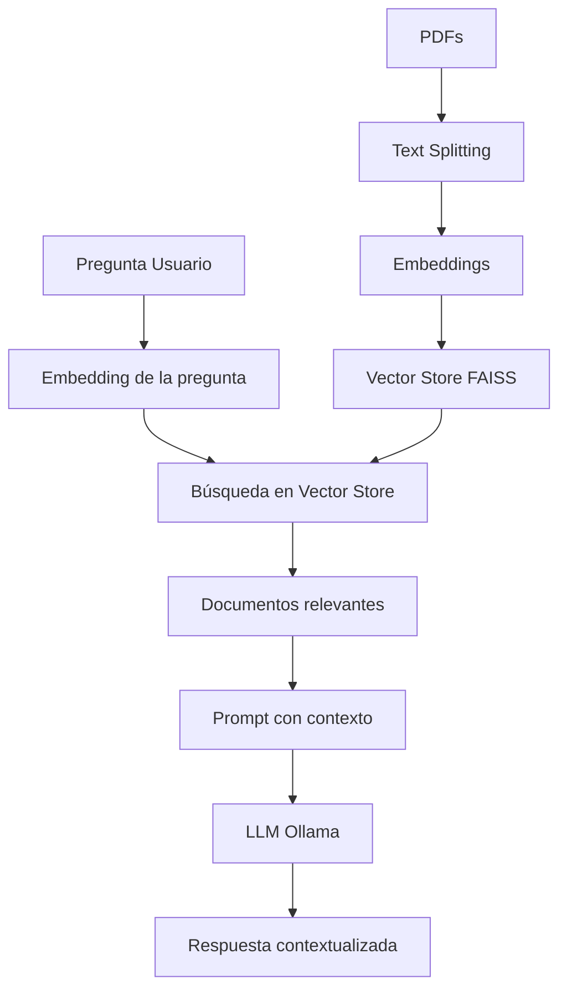

# 🤖 Tienda Alemana - Chat Engine - Backend

Backend para el sistema de chatbot inteligente de Tienda Alemana, construido con Node.js, Express, LangChain y Ollama usando arquitectura RAG (Retrieval-Augmented Generation) para responder preguntas específicas sobre productos, precios, ubicaciones y sucursales basándose en documentos PDF.

## 📋 Contexto del Proyecto

Tienda Alemana es una cadena de supermercados que busca mejorar la experiencia de
atención a sus clientes, ofreciendo un canal de soporte automatizado mediante un chatbot
inteligente. Con el fin de resolver consultas frecuentes como precios, disponibilidad,
ubicación de productos dentro de la tienda, horarios y direcciones de sus sucursales.

### Documentos requeridos:

- **Catálogo de Productos**: Artículos, precios y stock disponible
- **Ubicación Física de Productos**: Detalle de qué sección o góndola corresponde a cada artículo
- **Información General del Local**: Datos de cada sucursal (nombre, horario y dirección)

## 🚀 Características Principales

### RAG (Retrieval-Augmented Generation)

- **Vector Store**: FAISS para almacenamiento y búsqueda semántica de documentos
- **Embeddings**: Modelo `nomic-embed-text` (768 dimensiones) para vectorización
- **Retrieval**: Búsqueda de similitud semántica para encontrar documentos relevantes
- **Generation**: Respuestas contextualizadas usando información específica de documentos

### LangChain Framework

- **Document Processing**: Carga y división inteligente de PDFs
- **Embeddings Integration**: Integración seamless con Ollama embeddings
- **Chain Architecture**: Pipeline robusto para RAG con manejo de errores
- **Memory Management**: Contexto conversacional persistente por sesión

### Arquitectura Robusta

- **Sistema Híbrido**: RAG + Chat simple como fallback
- **Diagnóstico Completo**: Endpoint de diagnóstico para validar toda la pipeline
- **Logging Exhaustivo**: Trazabilidad completa de cada operación
- **Rate Limiting**: Protección contra abuso (100 req/15min)
- **Validación**: Validación robusta de datos de entrada
- **Error Handling**: Manejo graceful de errores con fallback automático

### Tecnologías

- **Backend**: Node.js + Express
- **LLM**: Ollama (llama3.2:1b para chat, nomic-embed-text para embeddings)
- **Vector Database**: FAISS
- **Framework AI**: LangChain
- **Document Processing**: PDF-Parse con text splitting inteligente

## 📋 Prerrequisitos

- **Node.js** (v18 o superior)
- **Ollama** instalado y ejecutándose localmente
- **Modelos Ollama** necesarios:
  - `llama3.2:1b` (modelo de chat)
  - `nomic-embed-text` (modelo de embeddings)
- **Archivos PDF** del negocio (catálogo, ubicaciones, sucursales)

## ⚙️ Instalación

### 1. Instalar dependencias

```bash
cd Backend
npm install
```

### 2. Configurar variables de entorno

```bash
cp .env.example .env
```

Edita el archivo `.env` con tu configuración:

```env
PORT=3001
NODE_ENV=development

# Configuración Ollama
OLLAMA_BASE_URL=http://127.0.0.1:11434
OLLAMA_MODEL=llama3.2:1b
OLLAMA_EMBEDDING_MODEL=nomic-embed-text

# Configuración de documentos
PDFS_FOLDER=./data/pdfs
VECTOR_STORE_PATH=./data/vector-store
CHUNK_SIZE=1000
CHUNK_OVERLAP=200

# Rate limiting
RATE_LIMIT_WINDOW_MS=900000
RATE_LIMIT_MAX_REQUESTS=100
```

### 3. Preparar Ollama

```bash
# Iniciar Ollama (en otra terminal)
ollama serve

# Descargar modelos requeridos
ollama pull llama3.2:1b
ollama pull nomic-embed-text

# Verificar que los modelos estén disponibles
ollama list
```

### 4. Preparar documentos PDF

```bash
# Crear estructura de carpetas
mkdir -p data/pdfs data/vector-store

# Coloca los archivos PDF en data/pdfs/:
# - Catálogo de Productos.pdf
# - Ubicación Física de Productos.pdf
# - Información de Locales.pdf
```

### 5. Configurar vector store

Una vez colocados los archivos PDFs en la ubicación anterior, ejecutar el siguiente comando para crear nuestro vector store con esos PDFs.

```bash
npm run setup-vector-store
```

Este proceso:

1. Lee todos los PDFs de `data/pdfs/`
2. Extrae el texto usando PDF-Parse
3. Divide el texto en chunks de 1000 caracteres con overlap de 200
4. Genera embeddings usando `nomic-embed-text`
5. Crea y guarda el vector store FAISS

### 6. Iniciar servidor

```bash
# Desarrollo con auto-reload
npm run dev

# Producción
npm start
```

## 🧠 Implementación RAG con LangChain

### Arquitectura RAG



### Componentes LangChain Utilizados

#### 1. Document Loading & Processing

```javascript
// Carga y procesamiento de PDFs
const PDFParse = require("pdf-parse");
const { RecursiveCharacterTextSplitter } = require("langchain/text_splitter");

// Configuración del text splitter
this.textSplitter = new RecursiveCharacterTextSplitter({
  chunkSize: 1000,
  chunkOverlap: 200,
  separators: ["\n\n", "\n", ". ", " ", ""],
});
```

#### 2. Embeddings

```javascript
// Embeddings con Ollama
const { OllamaEmbeddings } = require("@langchain/community/embeddings/ollama");

this.embeddings = new OllamaEmbeddings({
  baseUrl: "http://127.0.0.1:11434",
  model: "nomic-embed-text", // 768 dimensiones
});
```

#### 3. Vector Store

```javascript
// Vector store FAISS
const { FaissStore } = require("@langchain/community/vectorstores/faiss");

// Crear vector store desde documentos
const vectorStore = await FaissStore.fromTexts(
  texts,
  metadatas,
  this.embeddings
);

// Guardar para persistencia
await vectorStore.save(vectorStorePath);
```

#### 4. Retrieval Chain

```javascript
// Configuración del retriever
const retriever = this.vectorStore.asRetriever({
  k: 5, // Top 5 documentos más relevantes
  searchType: "similarity",
});

// Chain RAG completa
this.chain = RunnableSequence.from([
  {
    context: retriever.pipe(formatDocs),
    question: new RunnablePassthrough(),
    conversationHistory: (input) => getConversationContext(input.userId),
  },
  promptTemplate,
  this.ollama,
  new StringOutputParser(),
]);
```

#### 5. Prompt Engineering

```javascript
const promptTemplate = PromptTemplate.fromTemplate(`
Eres un asistente de Tienda Alemana, una cadena de supermercados. 
Tu trabajo es ayudar a los clientes respondiendo preguntas sobre:
- Productos disponibles, precios y stock
- Ubicación de productos dentro de la tienda (góndolas y secciones)
- Información de sucursales (horarios, direcciones)

Contexto relevante de documentos:
{context}

{conversationHistory}

Pregunta actual del cliente: {question}

Instrucciones:
- Responde de manera amigable y profesional
- Mantén coherencia con la conversación anterior si existe
- Si la información no está disponible en el contexto, dilo claramente
- Para preguntas sobre precios, incluye el símbolo $ y el valor exacto
- Para ubicaciones, menciona la góndola o sección específica
- Para horarios, menciona días y horas completas

Respuesta:
`);
```

### Sistema Híbrido con Fallback

El sistema implementa un enfoque híbrido robusto:

1. **RAG Principal**: Intenta usar documentos específicos
2. **Chat con Contexto**: Si RAG falla, usa contexto conversacional
3. **Fallback Simple**: Chat básico sin contexto como último recurso

```javascript
async hybridChat(message, sessionId) {
  // 1. Intentar RAG con documentos específicos
  try {
    const docs = await this.vectorStore.similaritySearch(message, 3);
    if (docs.length > 0) {
      // Generar respuesta con contexto de documentos
      return await this.generateRAGResponse(message, docs, sessionId);
    }
  } catch (ragError) {
    logger.error("RAG falló, usando contexto conversacional", ragError);
  }

  // 2. Fallback con contexto conversacional
  return await this.generateContextualResponse(message, sessionId);
}
```

## 📚 API Documentation

### Base URL

```
http://localhost:3001/api
```

### Authentication

No authentication required for current implementation.

### Rate Limiting

- **Limit**: 100 requests per 15 minutes per IP
- **Headers**: `X-RateLimit-Limit`, `X-RateLimit-Remaining`, `X-RateLimit-Reset`

---

## 🤖 Chat Endpoints

### POST /api/chat

Enviar un mensaje al chatbot y recibir una respuesta contextualizada.

**Request Body:**

```json
{
  "message": "¿Cuánto cuesta la leche de 1 litro?",
  "userId": "user123" // Opcional, para mantener contexto conversacional
}
```

**Response:**

```json
{
  "success": true,
  "data": {
    "response": "La Leche Entera de 1 litro cuesta $45 y tenemos 120 unidades disponibles. La puedes encontrar en la Góndola de Lácteos (Góndola 2).",
    "userId": "user123",
    "timestamp": "2025-06-30T01:15:30.123Z",
    "ragUsed": true
  }
}
```

**Error Response:**

```json
{
  "success": false,
  "error": "Error procesando la consulta",
  "message": "Detailed error message",
  "timestamp": "2025-06-30T01:15:30.123Z"
}
```

### POST /api/chat/search

Buscar documentos relevantes sin generar respuesta del chatbot.

**Request Body:**

```json
{
  "query": "precios de productos lácteos",
  "limit": 5 // Opcional, default: 5
}
```

**Response:**

```json
{
  "success": true,
  "data": {
    "documents": [
      {
        "content": "La Leche Entera de 1 litro se vende a $45 y tenemos 120 unidades...",
        "metadata": {
          "source": "Catálogo de Productos.pdf",
          "type": "catalog",
          "chunkIndex": 0,
          "chunkSize": 984
        },
        "score": 0.85
      }
    ],
    "totalFound": 3,
    "query": "precios de productos lácteos"
  }
}
```

### GET /api/chat/health

Verificar estado del servicio de chat.

**Response:**

```json
{
  "success": true,
  "data": {
    "status": "healthy",
    "initialized": true,
    "ollama": "connected",
    "vectorStore": "loaded",
    "timestamp": "2025-06-30T01:15:30.123Z"
  }
}
```

### GET /api/chat/diagnose

Ejecutar diagnóstico completo del sistema RAG.

**Response:**

```json
{
  "success": true,
  "data": {
    "diagnosis": {
      "timestamp": "2025-06-30T01:15:30.123Z",
      "initialized": true,
      "components": {
        "ollama": true,
        "embeddings": true,
        "vectorStore": true,
        "chain": true
      },
      "tests": {
        "ollamaConnection": {
          "success": true,
          "data": {
            "status": "connected",
            "model": "llama3.2:1b",
            "version": "0.9.0"
          }
        },
        "embeddings": {
          "success": true,
          "dimensions": 768,
          "sampleValues": [0.48, 0.62, -3.83, -0.12, 1.84]
        },
        "vectorSearch": {
          "success": true,
          "documentsFound": 2,
          "sampleContent": ["texto del documento...", "otro texto..."]
        },
        "endToEndRAG": {
          "success": true,
          "ragUsed": true,
          "responseLength": 245
        }
      }
    }
  }
}
```

### POST /api/chat/reinitialize

Reinicializar el servicio de chat (útil después de actualizar documentos).

**Response:**

```json
{
  "success": true,
  "data": {
    "message": "Chat service reinitialized successfully",
    "timestamp": "2025-06-30T01:15:30.123Z"
  }
}
```

---

## 📄 Document Management Endpoints

### POST /api/documents/upload

Subir y procesar nuevos archivos PDF.

**Request:**

- **Content-Type**: `multipart/form-data`
- **Field**: `pdfs` (puede ser múltiples archivos)

**Response:**

```json
{
  "success": true,
  "data": {
    "message": "Documents processed successfully",
    "filesProcessed": 2,
    "documentsCreated": 15,
    "vectorStoreUpdated": true,
    "files": ["catalogo.pdf", "ubicaciones.pdf"]
  }
}
```

### POST /api/documents/setup

Configurar vector store desde PDFs por defecto en `data/pdfs/`.

**Response:**

```json
{
  "success": true,
  "data": {
    "message": "Vector store configured successfully",
    "documentsProcessed": 4,
    "pdfFiles": ["Catálogo de Productos.pdf", "Información de Locales.pdf"],
    "vectorStorePath": "./data/vector-store"
  }
}
```

### GET /api/documents/status

Obtener estado de los documentos procesados.

**Response:**

```json
{
  "success": true,
  "data": {
    "vectorStoreExists": true,
    "vectorStorePath": "./data/vector-store",
    "lastUpdated": "2025-06-30T01:05:02.695Z",
    "documentCount": 4,
    "sourceFiles": [
      {
        "name": "Catálogo de Productos.pdf",
        "type": "catalog",
        "processedAt": "2025-06-30T01:05:02.695Z",
        "chunks": 2
      }
    ]
  }
}
```

### DELETE /api/documents/reset

Reiniciar vector store (eliminar todos los documentos).

**Response:**

```json
{
  "success": true,
  "data": {
    "message": "Vector store reset successfully",
    "timestamp": "2025-06-30T01:15:30.123Z"
  }
}
```

---

## 🏥 Health Check Endpoints

### GET /api/health

Estado general del servidor.

**Response:**

```json
{
  "success": true,
  "data": {
    "status": "healthy",
    "timestamp": "2025-06-30T01:15:30.123Z",
    "uptime": 3600,
    "environment": "development",
    "version": "1.0.0"
  }
}
```

### GET /api/health/detailed

Estado detallado de todos los servicios.

**Response:**

```json
{
  "success": true,
  "data": {
    "server": {
      "status": "healthy",
      "uptime": 3600,
      "memory": {
        "used": "145.2 MB",
        "total": "2.1 GB"
      }
    },
    "ollama": {
      "status": "connected",
      "baseUrl": "http://127.0.0.1:11434",
      "model": "llama3.2:1b",
      "embeddings": "nomic-embed-text"
    },
    "vectorStore": {
      "status": "loaded",
      "path": "./data/vector-store",
      "documentCount": 4
    },
    "chatService": {
      "status": "initialized",
      "initialized": true
    }
  }
}
```

---

## 📝 Request/Response Examples

### Ejemplo 1: Consulta de Precio

```bash
curl -X POST http://localhost:3001/api/chat \
  -H "Content-Type: application/json" \
  -d '{
    "message": "¿Cuánto cuesta el jugo de naranja?",
    "userId": "customer_001"
  }'
```

**Respuesta esperada:**

```json
{
  "success": true,
  "data": {
    "response": "El Jugo de Naranja de 1 litro cuesta $89 y tenemos 90 unidades disponibles. Lo puedes encontrar en la Góndola de Bebidas.",
    "userId": "customer_001",
    "timestamp": "2025-06-30T01:15:30.123Z",
    "ragUsed": true
  }
}
```

### Ejemplo 2: Consulta de Ubicación

```bash
curl -X POST http://localhost:3001/api/chat \
  -H "Content-Type: application/json" \
  -d '{
    "message": "¿Dónde encuentro el yogur de frutilla?",
    "userId": "customer_001"
  }'
```

### Ejemplo 3: Subir Documentos

```bash
curl -X POST http://localhost:3001/api/documents/upload \
  -F "pdfs=@./catalogo-actualizado.pdf" \
  -F "pdfs=@./nuevas-ubicaciones.pdf"
```

### Ejemplo 4: Buscar Documentos

```bash
curl -X POST http://localhost:3001/api/chat/search \
  -H "Content-Type: application/json" \
  -d '{
    "query": "productos con descuento",
    "limit": 3
  }'
```

---

## ⚠️ Error Codes

| Code | Description           | Example                      |
| ---- | --------------------- | ---------------------------- |
| 400  | Bad Request           | Missing required fields      |
| 429  | Too Many Requests     | Rate limit exceeded          |
| 500  | Internal Server Error | Ollama connection failed     |
| 503  | Service Unavailable   | Chat service not initialized |

### Error Response Format

```json
{
  "success": false,
  "error": "Error description",
  "message": "Detailed error message",
  "code": "ERROR_CODE",
  "timestamp": "2025-06-30T01:15:30.123Z"
}
```

## 🏗️ Arquitectura del Sistema

### Estructura de Archivos

```
Backend/
├── src/
│   ├── server.js                    # Servidor Express principal
│   ├── routes/                      # Definición de endpoints
│   │   ├── chat.js                 # Rutas del chatbot (/api/chat/*)
│   │   ├── documents.js            # Gestión de documentos (/api/documents/*)
│   │   └── health.js               # Health checks (/api/health/*)
│   ├── services/                    # Lógica de negocio
│   │   ├── chatService.js          # Servicio principal RAG + Chat
│   │   ├── documentService.js      # Procesamiento de PDFs
│   │   └── sessionService.js       # Gestión de sesiones de usuario
│   ├── middleware/                  # Middlewares Express
│   │   ├── errorHandler.js         # Manejo centralizado de errores
│   │   ├── rateLimiter.js          # Rate limiting por IP
│   │   └── validation.js           # Validación de requests
│   ├── utils/                       # Utilidades
│   │   └── logger.js               # Sistema de logging (Winston)
│   └── scripts/                     # Scripts de configuración
│       └── setupVectorStore.js     # Setup inicial del vector store
├── data/                           # Datos persistentes
│   ├── pdfs/                       # Archivos PDF fuente
│   └── vector-store/               # Vector store FAISS
├── logs/                           # Archivos de log
│   ├── app.log                     # Logs generales
│   ├── error.log                   # Solo errores
│   └── exceptions.log              # Excepciones no capturadas
├── .env                            # Variables de entorno
├── package.json                    # Dependencias y scripts
└── README.md                       # Esta documentación
```

### Flujo de Datos RAG

1. **Ingesta de Documentos**:

   ```
   PDF Files → PDF-Parse → Text Chunks → Embeddings → FAISS Vector Store
   ```

2. **Consulta del Usuario**:

   ```
   User Query → Embedding → Vector Search → Relevant Docs → LLM → Response
   ```

3. **Gestión de Sesiones**:
   ```
   User ID → Session Store → Conversation History → Context for LLM
   ```

### Componentes Clave

#### ChatService (`src/services/chatService.js`)

- **Propósito**: Servicio principal que orquesta todo el pipeline RAG
- **Responsabilidades**:

  - Inicialización de Ollama (chat + embeddings)
  - Carga y gestión del vector store FAISS
  - Ejecución del pipeline RAG híbrido
  - Diagnóstico y health checks
  - Manejo de contexto conversacional

- **Métodos principales**:
  ```javascript
  async initialize()           // Inicializa todos los componentes
  async chat(message, userId)  // Endpoint principal de chat
  async hybridChat()          // Lógica RAG híbrida
  async diagnoseRAG()         // Diagnóstico completo
  async loadVectorStore()     // Carga del vector store
  ```

#### DocumentService (`src/services/documentService.js`)

- **Propósito**: Procesamiento y gestión de documentos PDF
- **Responsabilidades**:

  - Extracción de texto de PDFs
  - División inteligente en chunks
  - Creación y actualización del vector store
  - Categorización automática de documentos

- **Flujo de procesamiento**:
  ```javascript
  PDF → extractTextFromPDF() → splitIntoChunks() →
  categorizeDocument() → createVectorStore() → save()
  ```

#### SessionService (`src/services/sessionService.js`)

- **Propósito**: Gestión de sesiones y contexto conversacional
- **Características**:
  - Almacenamiento en memoria de conversaciones
  - Límite de mensajes por sesión (10 por defecto)
  - Contexto formateado para el LLM
  - Auto-cleanup de sesiones antigas

### Integraciones LangChain

#### 1. Document Loaders

```javascript
// No usa loaders built-in, procesamiento custom con PDF-Parse
// para mayor control sobre metadata y categorización
const data = await PDFParse(pdfBuffer);
const chunks = await this.textSplitter.splitText(data.text);
```

#### 2. Text Splitters

```javascript
const { RecursiveCharacterTextSplitter } = require("langchain/text_splitter");

this.textSplitter = new RecursiveCharacterTextSplitter({
  chunkSize: 1000, // Tamaño de cada chunk
  chunkOverlap: 200, // Overlap entre chunks
  separators: ["\n\n", "\n", ". ", " ", ""], // Separadores inteligentes
});
```

#### 3. Embeddings

```javascript
const { OllamaEmbeddings } = require("@langchain/community/embeddings/ollama");

// Configuración de embeddings con modelo específico
this.embeddings = new OllamaEmbeddings({
  baseUrl: "http://127.0.0.1:11434",
  model: "nomic-embed-text", // Modelo optimizado para español
});
```

#### 4. Vector Stores

```javascript
const { FaissStore } = require("@langchain/community/vectorstores/faiss");

// Creación desde textos
const vectorStore = await FaissStore.fromTexts(
  texts, // Array de contenidos
  metadatas, // Array de metadatos paralelo
  embeddings // Instancia de embeddings
);

// Persistencia
await vectorStore.save(path);
const loadedStore = await FaissStore.load(path, embeddings);
```

#### 5. Retrievers

```javascript
// Configuración del retriever con parámetros optimizados
const retriever = this.vectorStore.asRetriever({
  k: 5, // Top-K documentos más relevantes
  searchType: "similarity", // Tipo de búsqueda
  searchKwargs: {
    scoreThreshold: 0.7, // Threshold de relevancia
  },
});
```

#### 6. Chains y Runnables

```javascript
const {
  RunnableSequence,
  RunnablePassthrough,
} = require("@langchain/core/runnables");

// Chain completa RAG
this.chain = RunnableSequence.from([
  {
    context: retriever.pipe(formatDocs), // Contexto de documentos
    question: new RunnablePassthrough(), // Pregunta original
    conversationHistory: (input) => {
      // Historia conversacional
      return sessionService.getConversationContext(input.userId);
    },
  },
  promptTemplate, // Template del prompt
  this.ollama, // Modelo de chat
  new StringOutputParser(), // Parser de salida
]);
```

### Prompts Engineering

#### Prompt Principal RAG

```javascript
const promptTemplate = PromptTemplate.fromTemplate(`
Eres un asistente de Tienda Alemana, una cadena de supermercados. 
Tu trabajo es ayudar a los clientes respondiendo preguntas sobre:
- Productos disponibles, precios y stock
- Ubicación de productos dentro de la tienda (góndolas y secciones)
- Información de sucursales (horarios, direcciones)

Contexto relevante de documentos:
{context}

{conversationHistory}

Pregunta actual del cliente: {question}

Instrucciones:
- Responde de manera amigable y profesional
- Mantén coherencia con la conversación anterior si existe
- Si la información no está disponible en el contexto, dilo claramente
- Para preguntas sobre precios, incluye el símbolo $ y el valor exacto
- Para ubicaciones, menciona la góndola o sección específica
- Para horarios, menciona días y horas completas
- Si el cliente hace referencia a algo mencionado anteriormente, úsalo como contexto
- Si no puedes responder completamente, sugiere contactar con el personal de la tienda

Respuesta:
`);
```

#### Características del Prompt

- **Contexto específico**: Define claramente el rol y dominio
- **Instrucciones detalladas**: Comportamiento esperado para diferentes tipos de consultas
- **Variables dinámicas**: Contexto de documentos, historia conversacional, pregunta actual
- **Fallback guidance**: Instrucciones para casos sin información suficiente

### Logging y Monitoreo

#### Configuración Winston

```javascript
// logger.js - Sistema de logging multi-level
const winston = require("winston");

const logger = winston.createLogger({
  level: "debug",
  format: winston.format.combine(
    winston.format.timestamp(),
    winston.format.errors({ stack: true }),
    winston.format.json()
  ),
  transports: [
    new winston.transports.File({ filename: "logs/error.log", level: "error" }),
    new winston.transports.File({ filename: "logs/app.log" }),
    new winston.transports.Console({
      format: winston.format.combine(
        winston.format.colorize(),
        winston.format.simple()
      ),
    }),
  ],
});
```

#### Logs Estructurados RAG

- **🚀 Inicialización**: Estados de componentes
- **🔍 Búsqueda**: Query, documentos encontrados, similitud
- **🤖 Generación**: Prompts, respuestas, métricas
- **❌ Errores**: Stack traces completos, contexto de fallo
- **📊 Métricas**: Tiempos de respuesta, uso de RAG vs fallback

## 🎯 Preguntas de ejemplo para evaluar el chatbot

### Catálogo de productos

- "¿Cuánto cuesta la Leche Entera de 1 litro?"
- "¿Cuántas unidades hay disponibles de Queso Muzzarella?"
- "¿Qué productos están por debajo de $80?"
- "¿Tienen stock de Atún en lata?"
- "¿Cuál es el precio del detergente con aroma a limón?"

### Ubicación de productos

- "¿En qué góndola puedo encontrar el Yogur de frutilla?"
- "¿Dónde está ubicado el arroz de 1 kg dentro del supermercado?"
- "¿En qué sección se encuentran los fideos?"
- "¿Dónde puedo encontrar el jugo de naranja?"
- "¿Qué productos están en la góndola 5?"

### Información de sucursales

- "¿Cuál es la dirección de la sucursal de Tienda Alemana en Pocitos?"
- "¿Hasta qué hora abre Tienda Alemana Central?"
- "¿Cuáles son los horarios de atención de la sucursal de Carrasco?"
- "¿Qué días abre la tienda ubicada en Av. Brasil?"
- "¿Tienen alguna tienda abierta los domingos?"

## 🔍 Logs y Monitoreo

### Estructura de Logs

```
logs/
├── app.log           # Logs generales (INFO, DEBUG, WARN)
├── error.log         # Solo errores (ERROR nivel)
└── exceptions.log    # Excepciones no capturadas
```

### Niveles de Log

- **� DEBUG**: Detalles técnicos, valores de variables, flujo interno
- **ℹ️ INFO**: Eventos importantes, inicializaciones, respuestas exitosas
- **⚠️ WARN**: Situaciones anómalas no críticas, fallbacks
- **❌ ERROR**: Errores que impiden operaciones, excepciones

### Logs RAG Específicos

```bash
# Inicialización
🚀 Inicializando ChatService...
✅ ChatOllama configurado
🧮 Configurando OllamaEmbeddings...
📚 Cargando vector store...

# Procesamiento de consulta
🔍 Iniciando búsqueda RAG para: "¿cuánto cuesta la leche?"
📄 Documentos encontrados: 3
📚 Contexto RAG generado: 1205 caracteres
✅ Respuesta generada exitosamente

# Diagnóstico
🔧 Iniciando diagnóstico completo de RAG...
✅ Test Ollama: PASSED
✅ Test Embeddings: PASSED (768 dims)
✅ Test Vector Search: PASSED (2 docs)
🎯 Diagnóstico completado: 4/4 tests passed
```

## 🛠️ Desarrollo y Comandos

### Scripts NPM Disponibles

```bash
npm run dev              # Desarrollo con nodemon (auto-reload)
npm start               # Producción
npm run setup-vector-store  # Configurar vector store inicial
```

### Variables de Entorno Completas

```env
# Servidor
PORT=3001
NODE_ENV=development

# Ollama Configuration
OLLAMA_BASE_URL=http://127.0.0.1:11434
OLLAMA_MODEL=llama3.2:1b
OLLAMA_EMBEDDING_MODEL=nomic-embed-text

# Document Processing
PDFS_FOLDER=./data/pdfs
VECTOR_STORE_PATH=./data/vector-store
CHUNK_SIZE=1000
CHUNK_OVERLAP=200

# Rate Limiting
RATE_LIMIT_WINDOW_MS=900000      # 15 minutos
RATE_LIMIT_MAX_REQUESTS=100      # 100 requests por ventana

# Session Management
MAX_MESSAGES_PER_SESSION=10      # Máximo mensajes en contexto
SESSION_TIMEOUT_MINUTES=30       # Timeout de sesión inactiva

# Logging
LOG_LEVEL=debug                  # debug, info, warn, error
LOG_TO_FILE=true
LOG_TO_CONSOLE=true
```

### Estructura de Configuración

#### Ollama Setup

```bash
# 1. Instalar Ollama
curl -fsSL https://ollama.ai/install.sh | sh

# 2. Iniciar servicio
ollama serve

# 3. Descargar modelos requeridos
ollama pull llama3.2:1b      # Modelo de chat (1.3GB)
ollama pull nomic-embed-text # Modelo de embeddings (274MB)

# 4. Verificar instalación
ollama list
```

#### Preparación de Datos

```bash
# Crear estructura de directorios
mkdir -p data/{pdfs,vector-store} logs

# Verificar permisos
chmod 755 data/
chmod 755 logs/

# Copiar PDFs de ejemplo
cp sample-pdfs/* data/pdfs/
```

## 🧪 Testing y Validación

### Testing Manual API

#### 1. Health Check

```bash
curl http://localhost:3001/api/health
```

#### 2. Diagnóstico RAG

```bash
curl http://localhost:3001/api/chat/diagnose
```

#### 3. Chat Test

```bash
curl -X POST http://localhost:3001/api/chat \
  -H "Content-Type: application/json" \
  -d '{"message": "¿Qué productos tienes disponibles?"}'
```

#### 4. Document Upload

```bash
curl -X POST http://localhost:3001/api/documents/upload \
  -F "pdfs=@test-catalog.pdf"
```

### Casos de Prueba Recomendados

#### Consultas de Productos

```bash
# Precios específicos
"¿Cuánto cuesta la leche de 1 litro?"
"¿Cuál es el precio del yogur de frutilla?"

# Stock y disponibilidad
"¿Tienen stock de atún en lata?"
"¿Cuántas unidades hay de queso muzzarella?"

# Comparación de precios
"¿Qué productos cuestan menos de $50?"
```

#### Consultas de Ubicación

```bash
# Ubicación específica
"¿Dónde encuentro el arroz?"
"¿En qué góndola está el detergente?"

# Navegación por secciones
"¿Qué productos hay en la góndola 3?"
"¿Qué hay en la sección de lácteos?"
```

#### Consultas de Sucursales

```bash
# Información de horarios
"¿A qué hora abre la sucursal de Pocitos?"
"¿Qué días están abiertos?"

# Direcciones
"¿Cuál es la dirección de la tienda central?"
```

### Métricas de Performance

#### Tiempos Esperados

- **Inicialización**: 2-5 segundos
- **Consulta simple**: 1-3 segundos
- **Consulta RAG**: 2-5 segundos
- **Upload documento**: 5-15 segundos (depende del tamaño)

#### Recursos del Sistema

- **RAM**: ~200-500MB (depende del modelo Ollama)
- **Almacenamiento**: ~50MB para vector store típico
- **CPU**: Picos durante generación de embeddings

## 🚨 Solución de Problemas

### Problemas Comunes y Soluciones

#### 1. Error: Cannot connect to Ollama

```bash
# Síntomas
❌ Error conectando con Ollama: connect ECONNREFUSED 127.0.0.1:11434

# Soluciones
# Verificar que Ollama esté ejecutándose
ollama serve

# Verificar que los modelos estén descargados
ollama list

# Verificar conectividad
curl http://localhost:11434/api/version
```

#### 2. Error: No PDF files found

```bash
# Síntomas
❌ No se encontraron archivos PDF para procesar

# Soluciones
# Crear carpeta y agregar PDFs
mkdir -p data/pdfs
cp your-pdfs/* data/pdfs/

# Verificar archivos
ls -la data/pdfs/
```

#### 3. Error: Vector store incompatible

```bash
# Síntomas
❌ Query vector must have the same length as the number of dimensions (2048)

# Soluciones
# Eliminar vector store incompatible
rm -rf data/vector-store

# Verificar configuración de embedding model
grep OLLAMA_EMBEDDING_MODEL .env

# Recrear vector store
npm run setup-vector-store
```

#### 4. Error: Embedding dimensions mismatch

```bash
# Síntomas
❌ Embeddings funcionando, dimensiones: 2048 (esperado: 768)

# Causa
# Configuración incorrecta en documentService.js usando OLLAMA_MODEL
# en lugar de OLLAMA_EMBEDDING_MODEL

# Solución
# Verificar que documentService.js use:
model: process.env.OLLAMA_EMBEDDING_MODEL || "nomic-embed-text"
```

#### 5. Rate Limit Exceeded

```bash
# Síntomas
❌ Too Many Requests: Rate limit exceeded

# Soluciones
# Esperar 15 minutos o ajustar configuración
RATE_LIMIT_MAX_REQUESTS=200
RATE_LIMIT_WINDOW_MS=900000
```

#### 6. Out of Memory (OOM)

```bash
# Síntomas
❌ JavaScript heap out of memory

# Soluciones
# Aumentar memoria Node.js
node --max-old-space-size=4096 src/server.js

# Reducir chunk size
CHUNK_SIZE=500
CHUNK_OVERLAP=100
```

### Debugging Paso a Paso

#### 1. Verificar Estado del Sistema

```bash
# Health check general
curl http://localhost:3001/api/health

# Estado detallado
curl http://localhost:3001/api/health/detailed

# Diagnóstico RAG completo
curl http://localhost:3001/api/chat/diagnose
```

#### 2. Revisar Logs

```bash
# Logs en tiempo real
tail -f logs/app.log

# Solo errores
tail -f logs/error.log

# Buscar errores específicos
grep "ERROR" logs/app.log
grep "Vector store" logs/app.log
```

#### 3. Validar Configuración

```bash
# Verificar variables de entorno
cat .env

# Verificar modelos Ollama
ollama list

# Verificar archivos PDF
ls -la data/pdfs/

# Verificar vector store
ls -la data/vector-store/
```

#### 4. Testing Incremental

```bash
# 1. Test básico de servidor
curl http://localhost:3001/api/health

# 2. Test Ollama
curl http://localhost:3001/api/chat/diagnose

# 3. Test chat simple
curl -X POST http://localhost:3001/api/chat \
  -H "Content-Type: application/json" \
  -d '{"message": "hola"}'

# 4. Test RAG específico
curl -X POST http://localhost:3001/api/chat \
  -H "Content-Type: application/json" \
  -d '{"message": "¿cuánto cuesta la leche?"}'
```

### Configuración de Performance

#### Para Desarrollo (Recursos Limitados)

```env
# Modelo más pequeño
OLLAMA_MODEL=llama3.2:1b

# Chunks más pequeños
CHUNK_SIZE=500
CHUNK_OVERLAP=100

# Menos documentos en retrieval
RETRIEVAL_K=3

# Rate limiting más restrictivo
RATE_LIMIT_MAX_REQUESTS=50
```

#### Para Producción (Recursos Abundantes)

```env
# Modelo más grande
OLLAMA_MODEL=llama3.2:3b

# Chunks más grandes para mejor contexto
CHUNK_SIZE=1500
CHUNK_OVERLAP=300

# Más documentos en retrieval
RETRIEVAL_K=7

# Rate limiting más permisivo
RATE_LIMIT_MAX_REQUESTS=200
```
